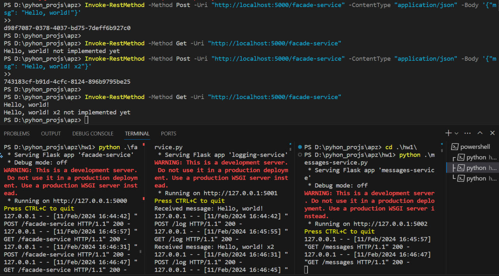

# Microservices Architecture Project

This project implements a simple microservices architecture consisting of three microservices:

1. `facade-service`: Accepts POST and GET requests from clients and interacts with other microservices.
2. `logging-service`: Stores incoming messages in memory and provides them upon request.
3. `messages-service`: Serves as a placeholder for future functionality, currently returns a static message.

## Functional Description

### HTTP POST Request Flow

1. Client sends a POST request to `facade-service` with a text message.
2. `facade-service` generates a unique UUID for the message and sends it to `logging-service`.
3. `logging-service` stores the message along with its UUID.
4. `facade-service` returns the generated UUID to the client.

### HTTP GET Request Flow

1. Client sends a GET request to `facade-service`.
2. `facade-service` fetches messages from `logging-service` and messages from `messages-service`.
3. `facade-service` combines and returns the responses from both services to the client.

## Result

