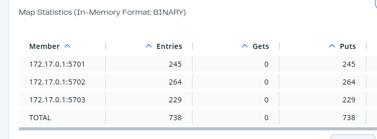
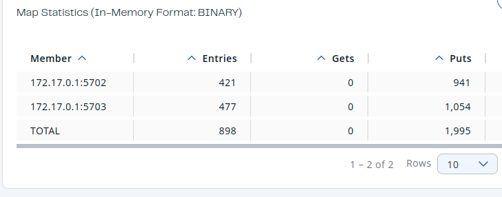
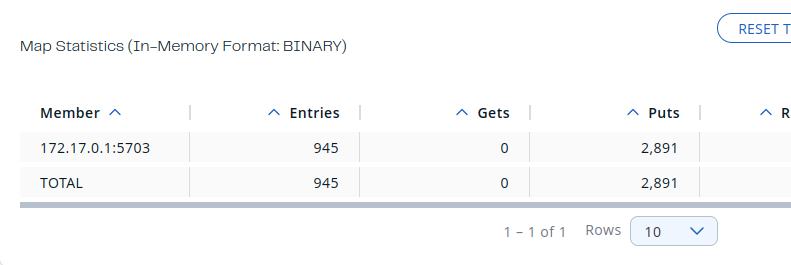

# Hazelcast homework

## Hazelcast installation

I chose to use docker cluster launched by

```bash
docker run \
    -it \
    --network hazelcast-network \
    --rm \
    -e HZ_NETWORK_PUBLICADDRESS=172.17.0.1:5701 \
    -e HZ_CLUSTERNAME=haz_hw1 \
    -p 5701:5701 hazelcast/hazelcast:5.3.6
```

## Adding 2 more members to the cluster

```bash
docker run\
 --name my-third-member\
 --network hazelcast-network\  
 -e HZ_NETWORK_PUBLICADDRESS=172.17.0.1:5703\
 -e HZ_CLUSTERNAME=haz_hw1\
 -p 5703:5701 hazelcast/hazelcast:5.3.6
```


## Client launches with distributed map

Script that was launched for this part is in dist_map.py

### With 3 nodes

Observed data loss, the data is not evenly distributed, but close to evenly



### With 2 nodes

Same as with 3 nodes



### With 1 node

With 1 node some data is still lost, so concurrency is not the only issue that causes data loss



### What to do?

The map should be blocking. I think that problem oocurs when map is not finished with writing pervious value and next one arrives. Aslo there is no ckeck if the connection is established. If there is an availabilty check, both problems will be solved.

## Distributed map with locks

