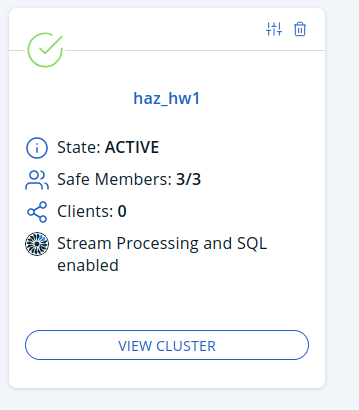
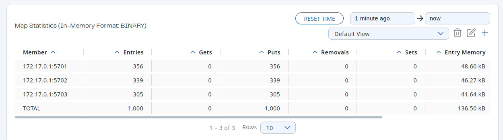
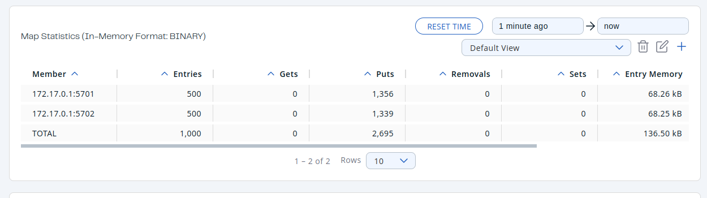
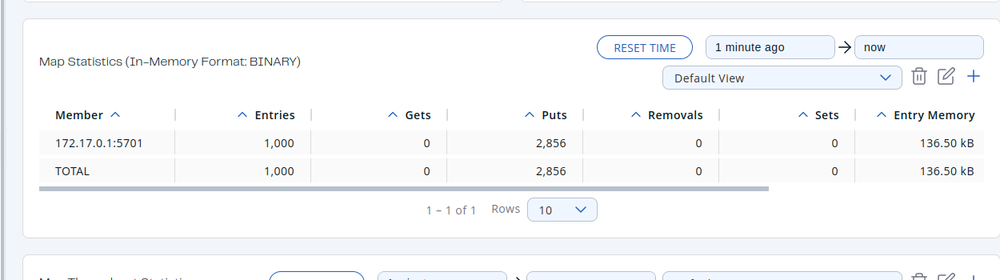
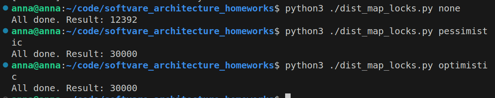
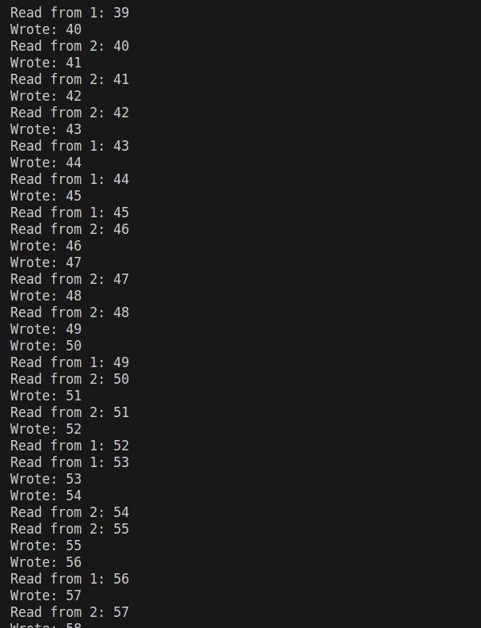
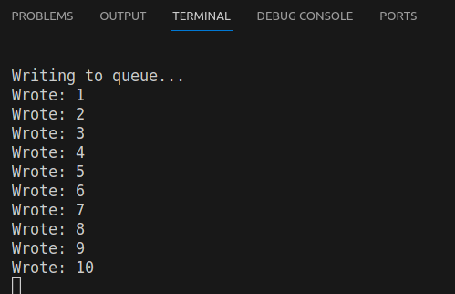

# Hazelcast homework

## Hazelcast installation

I chose to use docker cluster launched by

```bash
docker run \
    -it \
    --network hazelcast-network \
    --rm \
    -e HZ_NETWORK_PUBLICADDRESS=172.17.0.1:5701 \
    -e HZ_CLUSTERNAME=haz_hw1 \
    -p 5701:5701 hazelcast/hazelcast:5.3.6
```

## Adding 2 more members to the cluster

```bash
docker run\
 --name my-third-member\
 --network hazelcast-network\  
 -e HZ_NETWORK_PUBLICADDRESS=172.17.0.1:5703\
 -e HZ_CLUSTERNAME=haz_hw1\
 -p 5703:5701 hazelcast/hazelcast:5.3.6
```



## Client launches with distributed map

### Management center launch

```bash
docker run     --network hazelcast-network  -e HZ_CLUSTERNAME=haz_hw1   -p 5705:8080 hazelcast/management-center:latest-snapshot
```

### Script

Script that was launched for this part is in dist_map.py

### With 3 nodes

No data loss, but distribution between not is not strictly even. Some cluster members have more values, some less, but all in all each cluster has around 1/3



### With 2 nodes

Now I killed one node from the terminal. I noticad how data that was distributed between 3 nodes at previous step became evenly distribited between the 2 remaining nodes. Then I deleted data and launched the script again. Surprizingly, data was distributed evenly between nodes. I did not experience data loss.



### With 1 node

Now I tried deleting data beforehand, but I still experienced no data loss.



### What to do?

The better question would be what to do to experince data loss. If i take away .blocking() in the script, I obtain data loss at each launch. But for me the fact that system for distributed services correctly manges cluster loss is a common sense and I don't see any problem with my obtained result.

## Distributed map with locks and without them

the script launched is in dist_map_locks.py

### 3 clients, no locks

If there is no blocking, some clients write the same values earlier, some later, so the final value is much less than 30000

### pessimistic locking

this method guarantees concurrency by completely blocking out other threads if one thread is currently using the resourece. it works quite slowly

### optimistic locking

here hazelcast might abort update if the version being updated is older ak not the same as latest present version

### Launch results




## Bounded queue

The behavior looks something like I expected:



I won't provide full screenshot as the log is long, but with 2 readers it seenms that queue does not manage to become full, as they read new values faster.

If I comment out reader threads, the code just reaches a lock and code execution doesn't proceed




